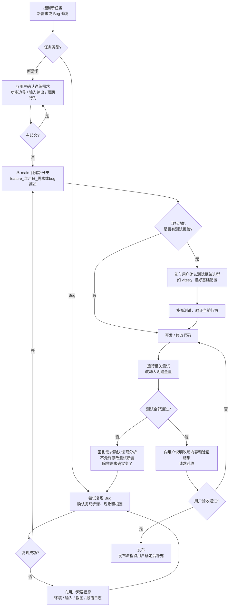

# 开发流程规范

接到任何新的开发任务（新需求或 bug 修复）时，必须严格按以下流程执行，不得跳步。

## 流程总览

## 1. 创建分支

- 每个新任务必须从 master（本仓库默认分支为 `main`）创建新分支。
- 命名格式：`feature_年月日_需求或bug简述`，日期为 8 位数字，例如：
  - `feature_20260918_json导出excel`
  - `feature_20260918_修复mermaid解析报错`
- 禁止直接在 master/main 上开发，禁止复用旧分支。

## 2. 需求确认 / Bug 复现

- 动手写代码之前，必须先与用户确认详细需求：功能边界、输入输出、预期行为。有歧义时先问清楚，不要凭猜测开发。
- 如果是 bug：
  1. 先自己尝试复现一遍，确认复现步骤、现象和根因；
  2. 无法复现时，向用户索要更多信息（环境、输入、截图、报错日志），不要盲改；
  3. 复现成功后再开始修复。

## 3. 测试覆盖

- 改动前：先检查目标功能是否有测试覆盖。
  - 没有的话，先补充测试（验证当前行为），再开始改动。
  - 注意：本仓库当前未配置测试框架。首次需要补测试时，先与用户确认测试框架选型（如 vitest），搭好基础配置后再按本流程执行。
- 改动后：重新跑一遍相关测试（如改动范围大则跑全量），必须全部通过。
- 测试不通过时回到第 2 步重新分析，不允许为了通过测试而修改测试断言本身（除非需求确实变了）。

## 4. 用户验收

- 测试全部通过后，向用户说明改动内容和验证结果，请求验收。
- 验收通过前不得发布、不得合并。
- 验收不通过时，按用户反馈修改，重复第 3-4 步。

## 5. 发布

- 用户验收通过后即可发布。
- 发布流程暂未定义，待用户确定后补充到本节。
